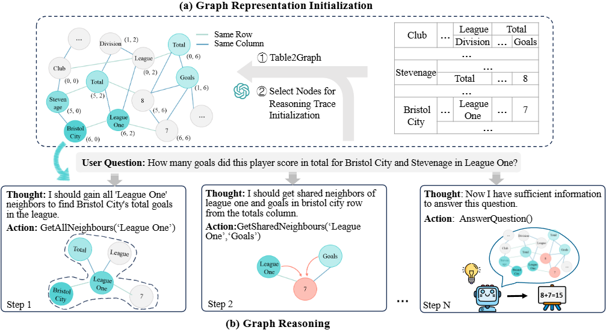

# GraphOTTER
Code for our paper [GraphOTTER: Evolving LLM-based Graph Reasoning for \\Complex Table Question Answering](https://arxiv.org/pdf/2412.01230) at COLING 2025.

## Intro
Complex Table Question Answering involves providing accurate answers to specific questions based on intricate tables that exhibit complex layouts and flexible header locations. Despite considerable progress having been made in the LLM era, the reasoning processes of existing methods are often implicit, feeding the entire table into prompts, making it difficult to effectively filter out irrelevant information in the table. To this end, we propose GraphOTTER that explicitly establishes the reasoning process to pinpoint the correct answers. In particular, GraphOTTER leverages a graph-based representation, transforming the complex table into an undirected graph. It then conducts step-by-step reasoning on the graph, with each step guided by a set of pre-defined intermediate reasoning actions. As such, it constructs a clear reasoning path and effectively identifies the answer to a given question. Comprehensive experiments on two benchmark datasets and two LLM backbones demonstrate the effectiveness of GraphOTTER. Further analysis indicates that its success may be attributed to the ability to efficiently filter out irrelevant information, thereby focusing the reasoning process on the most pertinent data. 


## Prerequisites
- python 3.9
- CUDA 11.4
- openai
- google-generativeai
- torch
- faiss

## Usage
```bash
bash start.sh
```

The script `start.sh` includes several configurable parameters:
- `--model`: LLM for reasoning and evaluation.
- `--base_url`: We deployed Qwen2 using [vllm](https://qwen.readthedocs.io/zh-cn/latest/deployment/vllm.html#openai-compatible-api-service), which can be accessed via an OpenAI-compatible API. Experiments with Gemini 1.5 can be performed without setting this parameter.
- `--dataset`: Name of the dataset (choose from [hitab,ait-qa]).
- `--qa_path`: The path of the Test QA pair.
- `--table_folder`: Paths for tables (Only for hitab).
- `--embedder_path`: Path of dense encoder.
- `--embed_cache_dir`: Path to the table embedding storage.
- `--temperature`: Temperature to reasoning and evaluation.
- `--max_iteration_depth`: Maximum number of iterations.
- `--seed`: Seed to reasoning and evaluation.

Given a complex table in a document, we cannot definitively determine the location of headers beforehand. In this case, our experiments follows this real-world setting and removes the annotated table header information from the both datasets. For AIT-QA, we deleted tables that could not eliminate the effects of known headers, and the deleted tables are in `dataset/AIT-QA/aitqa_clean_tables.json`.

## Citation

If you find our work helpful, please consider citing it:
```
@misc{li2024graphotter,
      title={GraphOTTER: Evolving LLM-based Graph Reasoning for Complex Table Question Answering}, 
      author={Qianlong Li and Chen Huang and Shuai Li and Yuanxin Xiang and Deng Xiong and Wenqiang Lei},
      year={2024},
      eprint={2412.01230},
      archivePrefix={arXiv},
      primaryClass={cs.CL},
      url={https://arxiv.org/abs/2412.01230}, 
}
```